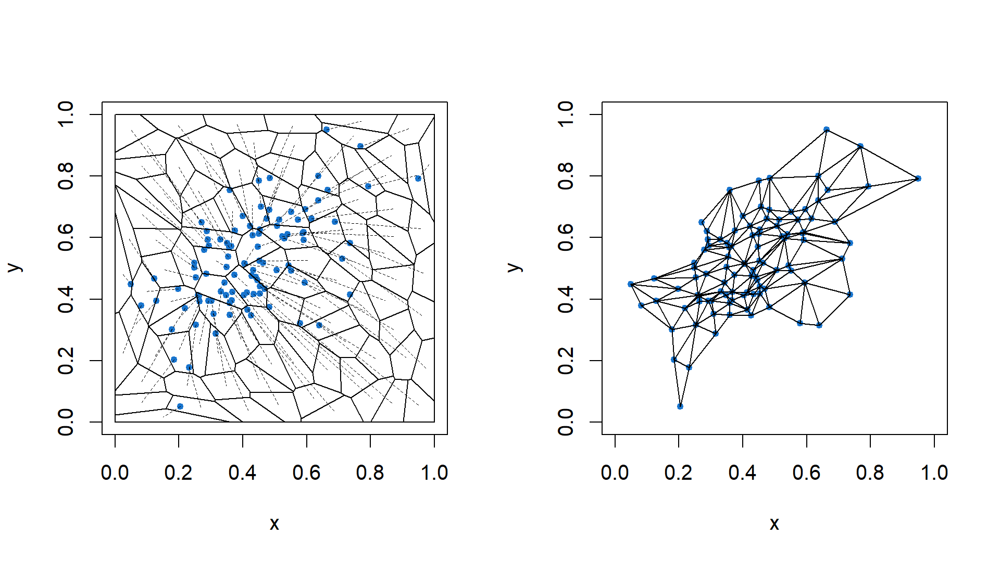

<!-- README.md is generated from README.Rmd. Please edit that file -->

# testOTM

<!-- badges: start -->

<!-- badges: end -->

`testOTM` is a R package that computes multivariate ranks and quantiles
defined through the theory of optimal transports. It also provides
several applications of these statistics, most notably the two-sample
multivariate goodness-of-fit testing.

## Installation

You can install the released version of testOTM from
[CRAN](https://CRAN.R-project.org) with:

``` r
install.packages("testOTM")
```

You can install the development version from
[GitHub](https://github.com/) with:

``` r
# install.packages("devtools")
# devtools::install_github("Francis-Hsu/testOTM")
```

## Example

This is a basic example which shows you how to use `testOTM` to
visualize the optimal transport map from \(U[0, 1]^2\) to a bivariate
normal sample:

``` r
library(testOTM)

# generate bivariate normal data
p = 2
n = 100
Sigma = matrix(c(2, 1, 1, 2), 2, 2)
eS = eigen(Sigma, symmetric = TRUE)
X = t(eS$vectors %*% diag(sqrt(pmax(eS$values, 0)), p) %*% matrix(rnorm(p * n), p))

# compute the optimal transport map from U[0, 1]^2 to the data
# notice that the data will be scale into [0, 1] range
X.OTM = tos.fit(X)

# plot the restricted Voronoi diagram and the restricted Delaunay triangulation
par(mfrow = c(1, 2))
plot(X.OTM, which = "Both", draw.center = F, draw.map = T)
```

<!-- -->

## Acknowledgment

The author is extremely grateful to Prof. [Bodhisattva
Sen](http://www.stat.columbia.edu/~bodhi/Bodhi/Welcome.html) and his
student Promit Ghosal for their guidance in the development of this
package. The author would also like to thank Dr. [Bruno
Lévy](https://members.loria.fr/BLevy/) for his assistance with the
[Geogram](http://alice.loria.fr/index.php/software/4-library/75-geogram.html)
library, and [TraME](http://www.trame-project.com/) team, whose
[`Rgeogram`](https://github.com/TraME-Project/Rgeogram) package provides
inspirations to the early build of this package.

## Reference

<div id="refs" class="references">

<div id="ref-FA1987">

Aurenhammer, F. 1987. “Power Diagrams: Properties, Algorithms and
Applications.” *SIAM Journal on Computing* 16 (1): 78–96.
<https://doi.org/10.1137/0216006>.

</div>

<div id="ref-B1991">

Brenier, Yann. 1991. “Polar Factorization and Monotone Rearrangement of
Vector-Valued Functions.” *Communications on Pure and Applied
Mathematics* 44 (4): 375–417. <https://doi.org/10.1002/cpa.3160440402>.

</div>

<div id="ref-CDS2013">

Cheng, Siu-Wing, Tamal Krishna Dey, and Jonathan Richard Shewchuk. 2013.
*Delaunay Mesh Generation*. Chapman; Hall/CRC.

</div>

<div id="ref-CGHH2017">

Chernozhukov, Victor, Alfred Galichon, Marc Hallin, and Marc Henry.
2017. “Monge–Kantorovich Depth, Quantiles, Ranks and Signs.” *The Annals
of Statistics* 45 (1): 223–56. <https://doi.org/10.1214/16-AOS1450>.

</div>

<div id="ref-GS2019">

Ghosal, Promit, and Bodhisattva Sen. 2019. “Multivariate Ranks and
Quantiles Using Optimal Transportation and Applications to
Goodness-of-Fit Testing.” <http://arxiv.org/abs/1905.05340>.

</div>

<div id="ref-WEB:GEOGRAM">

Inria, project ALICE-GRAPHYS. 2019. “Geogram: A Programming Library of
Geometric Algorithms.”
<http://alice.loria.fr/software/geogram/doc/html/index.html>.

</div>

<div id="ref-L2015">

Lévy, Bruno. 2015. “A Numerical Algorithm for L2 Semi-Discrete Optimal
Transport in 3D.” *ESAIM: M2AN* 49 (6): 1693–1715.
<https://doi.org/10.1051/m2an/2015055>.

</div>

<div id="ref-L2015HAL">

Lévy, Bruno. 2015. “Robustness and Efficiency of Geometric Programs The
Predicate Construction Kit (PCK).” *Computer-Aided Design*.
<https://hal.inria.fr/hal-01225202>.

</div>

<div id="ref-LS2018">

Lévy, Bruno, and Erica L. Schwindt. 2018. “Notions of Optimal Transport
Theory and How to Implement Them on a Computer.” *Computers & Graphics*
72: 135–48. <https://doi.org/10.1016/j.cag.2018.01.009>.

</div>

<div id="ref-Liu2009">

Liu, Yang, Wenping Wang, Bruno Lévy, Feng Sun, Dong-Ming Yan, Lin Lu,
and Chenglei Yang. 2009. “On Centroidal Voronoi Tessellation–Energy
Smoothness and Fast Computation.” *ACM Transactions on Graphics* 28 (4):
Article 101. <https://doi.org/10.1145/1559755.1559758>.

</div>

<div id="ref-M1995">

McCann, Robert J. 1995. “Existence and Uniqueness of Monotone
Measure-Preserving Maps.” *Duke Math. J.* 80 (2): 309–23.
<https://doi.org/10.1215/S0012-7094-95-08013-2>.

</div>

<div id="ref-TOG2017">

Toth, Csaba D., Joseph O’Rourke, and Jacob E. Goodman, eds. 2017.
*Handbook of Discrete and Computational Geometry*. 3rd ed. Chapman;
Hall/CRC.

</div>

<div id="ref-Xin2016">

Xin, Shi-Qing, Bruno Lévy, Zhonggui Chen, Lei Chu, Yaohui Yu, Changhe
Tu, and Wenping Wang. 2016. “Centroidal Power Diagrams with Capacity
Constraints: Computation, Applications, and Extension.” *ACM Trans.
Graph.* 35 (6): 244:1–244:12. <https://doi.org/10.1145/2980179.2982428>.

</div>

</div>
